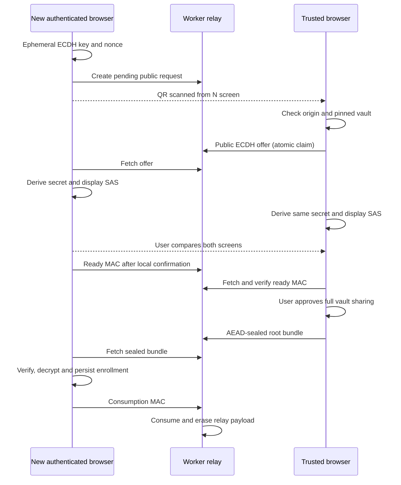

# Phase 4A: AEGIS Drop E2EE design

Status: proposal for review, not an implemented or audited cryptographic protocol.
Baseline: `f49acb666df6b372008f2367fb4e55d3dca7b4cd`, Phase 3, 30-day
server-authenticated cookie. This document is the only Phase 4A change.

Recommendation: one client-generated random vault master secret, random per-item
keys, AES-256-GCM envelopes, bounded file chunks, ephemeral P-256 ECDH QR pairing
with mandatory code comparison, and an offline recovery kit. Any trusted device
can provision another. Authentication controls server access; possession of the
vault secret controls decryption. Neither access credentials, session secrets,
Google tokens, nor Google identity enter encryption key derivation.

## 1. Threat model and limits of the claim

**Storage confidentiality assumes trustworthy client code and uncompromised
endpoints.** Worker, D1 and R2 receive only ciphertext and operational metadata,
never the plaintext vault master secret. A storage-reading operator cannot
recover content under these assumptions. This is not an unconditional guarantee
against the operator controlling the JavaScript delivered to the browser. A
malicious release can exfiltrate keys the next time a trusted device runs it.
Do not describe this as “zero knowledge.”

| Threat | Proposed protection | What remains possible |
| --- | --- | --- |
| D1 disclosure | Text, names, MIME and wrapped item keys are ciphertext | IDs, sizes, timing, counts, storage kind and relationships leak |
| R2 disclosure | File chunks are authenticated ciphertext | Object sizes, access patterns and existence leak |
| Storage-reading Cloudflare/operator | No plaintext master or item keys server-side | Traffic analysis, deletion, denial of service |
| Stolen session or access key | Logging in alone does not provide vault material | Read ciphertext, upload junk, delete history, interrupt pairing; no availability guarantee |
| Future compromised Google account | Google authentication still cannot unwrap vault material | Same authorization abuse; recovery policies must not grant encryption keys |
| Network attacker | HTTPS plus AEAD; physical QR and code comparison bind pairing | Blocking, traffic analysis; certificate/client compromise is outside this protection |
| Malicious uploaded content | AEAD authenticates bytes, not their safety | A trusted device can upload malware; decrypted content still needs safe handling |
| Stolen trusted device | OS lock and browser protection are first-line defenses | An unlocked device or extracted key material can expose the whole vault |
| Compromised JS, XSS, extension or service worker | Minimize attack surface and use CSP; no third-party executable scripts | Active same-origin code can use/extract secrets and plaintext; non-extractability does not solve this |
| Replay/rollback | Bind vault/item/version; immutable records; deduplicate IDs | A malicious server can replay valid history, omit items or resurrect deleted records |

AEAD detects modifications, chunk substitution and malformed files. It does not
prove history completeness, freshness, server ordering, deletion, human authorship
or device identity. All trusted devices have the same vault authority. No signed
append-only history or transparency service is proposed for v1.

## 2. Proposed architecture and separation

Three distinct states must exist in the UI: not authenticated; authenticated but
without a usable vault key; authenticated and vault-unlocked. Existing login
continues to use the HttpOnly cookie. A new Google-authenticated device would
still be in the second state. Only pairing or recovery moves it to the third.

Encryption/decryption belongs behind a small client data boundary. React receives
plaintext `TextItem`/`FileItem` views after successful decryption. The transport
and Worker receive versioned ciphertext envelopes. Server code validates bounds,
identifiers, versions and storage ownership, without parsing sensitive content.
Pagination stays newest-first, default 5/max 50, with timestamp/ID keyset cursors.

Items are immutable in v1. An edit creates a new item ID and new item secret;
it never re-encrypts changed plaintext under an existing envelope. An interrupted
upload may resend its identical frozen ciphertext, or restart with entirely new
keys and ID. No partial resume with reused chunk keys is allowed.

## 3. Master secret and key hierarchy

Generate `M`, 32 random bytes, with client Web Crypto `getRandomValues`. Generate
a random vault ID and random epoch/key ID independently; IDs are public labels,
not secrets. UUIDv4 item IDs are also generated by the client before encryption,
because they must be authenticated before the server sees the envelope.

All derivations use HKDF-SHA-256. For vault/item derivations, define
`KDF(secret, label, context)` as HKDF with
salt `vaultId` (16 bytes), and info a length-prefixed encoding of
`AEGIS-Drop`, protocol version, the distinct label and context. No ambiguous string
concatenation, truncated IDs, or user-selected algorithm names. An HKDF salt need
not be secret. Use full 256-bit derived symmetric keys.

| Key/material | Source and size | Purpose/lifetime |
| --- | --- | --- |
| `M` | Client CSPRNG, 256 bits | Vault root; shared among trusted devices and offline recovery |
| `Kwrap(item)` | HKDF(M, `item-wrap`, epochId + itemId), 256 bits | AES-GCM encryption of that item's random secret only |
| `Ditem` | Fresh client CSPRNG, 256 bits per item | Item envelope secret; never used as an AES key directly |
| `Kmanifest` | HKDF(Ditem, `item-manifest`, epochId + itemId), 256 bits | One text body or one file manifest |
| `Kfile` | HKDF(Ditem, `file-chunks`, epochId + itemId), 256 bits | File chunks only; different from manifest/wrapping keys |
| `Kcheck` | HKDF(M, `vault-check`, epochId), 256 bits | Immutable vault confirmation ciphertext |
| `Ldevice` | Local AES-GCM CSPRNG key, 256 bits, non-extractable | Wraps local root bundle; never synchronized |
| Pairing keys | Ephemeral ECDH + HKDF, separate labels | Provisioning AES, confirmation HMAC, SAS; one pairing only |
| `R` / `Krecovery` | Independent random 256-bit R / HKDF(R) | Offline recovery wrapping; never derived from authentication |

AES-GCM uses 128-bit tags and 96-bit IVs throughout. Each item key wrap and
manifest uses its own independently random IV. Per-item derivation limits common
wrapping-key reuse; changed envelopes still require new IDs and Ditem. Freeze
all encrypted bytes before upload. Never use timestamps, filenames, session IDs
or the access key as IVs or entropy. File IVs have the separate rule in section 5.

A single raw M directly encrypting every chunk would create unnecessary nonce
and purpose coupling. Envelope keys isolate items and permit a future root-wrap
rotation without re-encrypting bulk file bytes. This does **not** revoke devices
that retained old M and old wrapped item keys. Real revocation needs fresh keys
for future records, and stronger access/membership management.

Store a small immutable vault descriptor: version, vaultId, epochId and an AEAD
`keyCheck`. Its plaintext is a fixed domain-separated vault confirmation string
and the vault/epoch IDs; encrypt once under Kcheck with a random IV and AAD
encode(`vault-check/v1`, formatVersion, vaultId, epochId). The descriptor hash
covers its canonical header, IV and ciphertext; there is no circular AAD hash.
Trusted devices pin the exact descriptor hash locally. New devices receive
the authoritative descriptor/hash inside the approved pairing/recovery bundle,
not merely from the server. The first creator is a trust-on-first-use bootstrap;
a malicious server can replace an unpinned new installation's view.

Only one active epoch is implemented in v1. IDs reserve an upgrade boundary,
not an automatic key-rotation system. Locking clears in-memory keys and plaintext;
forgetting a device deletes its local root bundle and device key. Neither proves
erasure of copied material. Best-effort buffer clearing is useful, but JavaScript
and browser internals do not guarantee zeroization.

Primitives follow [Web Crypto](https://www.w3.org/TR/webcrypto/),
[HKDF, RFC 5869](https://www.rfc-editor.org/rfc/rfc5869.html), and
[NIST GCM](https://csrc.nist.gov/pubs/sp/800/38/d/final). The proposed composition
and wire formats need independent review and test vectors before production use.

## 4. Common header and text envelope

Use a fixed binary serialization for authenticated fields. Integers are unsigned
big-endian; UUIDs have a single 16-byte encoding; strings are UTF-8 with explicit
length prefixes. Reject unknown versions, nonzero reserved bytes, excess bytes,
invalid lengths, noncanonical base64url and inconsistent outer IDs.
HTTP JSON uses canonical base64url to carry binary values, but ciphertext and
AAD are computed over decoded binary fields, never raw JSON serialization.

The fixed 56-byte common header H is:

| Field | Bytes |
| --- | ---: |
| Magic `AGD1` | 4 |
| Format version, fixed 1 | 2 |
| Storage kind: 0 inline, 1 R2 | 1 |
| Reserved, fixed 0 | 1 |
| vaultId, epochId, itemId | 16 each |

A common item envelope stores H, wrap IV (12), wrapped Ditem (32 ciphertext +
16 tag), manifest IV (12), and manifest ciphertext including its 16-byte tag.
Wrap AAD is `encode("key-wrap/v1", H)`; manifest AAD is
`encode("manifest/v1", H, wrapIV, wrappedDitem)`. Labels use the same strict
length-prefixed encoding. A swapped wrap or different record cannot authenticate.

For text, the decrypted manifest is a bounded binary payload: manifest version
u8, content kind u8 (`text`), client-created-at milliseconds u64, UTF-8 byte length
u32, and exactly those text bytes. Maximum text remains 64 KiB UTF-8. There is no
plaintext `text_content`, plaintext content hash or server-side search index.
The transport must budget for tags, IVs, wrapping, headers and base64 overhead;
its request limit cannot remain the Phase 3 plaintext JSON limit.

Client timestamps are encrypted and authenticated, but are not proof of accurate
wall-clock time. D1's public `created_at` remains a server ordering hint and is
not included as trusted AAD: the server assigns it after encryption. A malicious
server can reorder valid items without breaking encryption. The UI must not
present server ordering as cryptographic freshness.

For files, the manifest uses content kind `file`, encrypted client timestamp,
plaintext byte count u64, chunk size u32, chunk count u32, UTF-8 filename length
u16 and bytes, ASCII MIME length u16 and bytes. Bound filename to 4096 UTF-8 bytes
and MIME to 255 bytes, and validate again after decryption. Content kind must match H storage kind; v1
requires chunk size 1 MiB and count exactly ceil(plaintext bytes / chunk size).
No directory paths,
unsafe control characters or MIME-based execution. Manifest encoding is frozen
with the envelope; optional fields require a new version rather than ad hoc AAD.

## 5. Streaming file format and browser paths

### Chunk cryptography

Use 1 MiB plaintext chunks, processed sequentially with backpressure. A 100 MiB
file has 100 chunks; an empty file has zero. Derive fresh Kfile from the fresh
Ditem. For chunk i (zero-based), IV is `zero64 || uint32be(i)`. **This is safe only
because Kfile is fresh for one immutable file and each index is encrypted once.**
Do not reuse this key for metadata, another file, changed content or a restarted
encryption pass. File sizes and counts are bounded well below counter exhaustion;
reject i >= 2^32. Retry by replaying existing ciphertext, not by improvising a
new nonce schedule. This is AES-GCM with framing, not a new cipher.

Let F = SHA-256 of the canonical complete item envelope. Chunk AAD includes a
`file-chunk/v1` label, H, F, i, expected plaintext chunk length, total plaintext
byte count, total chunk count and a final-chunk flag. The receiver derives the
length/count values from the authenticated decrypted manifest. They are not
trusted merely because a transport header says so.

R2 object bytes:

```text
"AGF1" (4) || H (56) || F (32)
repeated: ciphertextLength u32 || AES-GCM(chunk, IV(i), AAD(i))
```

Each nonfinal chunk must contain exactly 1 MiB + 16 tag bytes. The final length
is determined by the authenticated manifest. Check the object header against the
D1 envelope before processing chunks. Check every tag, expected index, count,
length and final flag; require exact EOF with no extra records or trailing bytes.
This catches corruption, truncation, duplication, reordering and splicing. There
is no unauthenticated “done” flag. Empty files require a valid zero-size manifest,
matching header and immediate EOF. No whole-file digest is needed for integrity.

The ciphertext object size is `92 + plaintextBytes + 20 * chunkCount`. At 100 MiB
it is 104,859,692 bytes. The upload prefix containing the envelope adds network
bytes beyond this. Application and edge limits must distinguish plaintext,
R2-object and request size. Do not silently reduce the plaintext limit or assume
the current 100 MiB Worker test proves account-edge acceptance. Cloudflare's
published body/CPU/memory limits must be checked for the actual account before
claiming 100 MiB production support. [Workers limits](https://developers.cloudflare.com/workers/platform/limits/)

### Upload without full-file memory

Web Crypto encrypts a supplied buffer; it is not a file streaming cipher API.
Read one File slice, encrypt one chunk, write it to a disk-backed sink, and release
references before reading the next. Target a small bounded number of chunk-sized
buffers, not a 100 MiB ArrayBuffer, an array of chunks, or a giant base64 string.

The v1 reference path is encrypted staging in OPFS: serialize the upload prefix
and R2 object incrementally into an origin-private temporary file, close it, obtain
a backing File, and pass that File directly to fetch. This works with the existing
raw-body Worker approach without depending on request-body ReadableStream support.
It is chunked, disk-staged encryption followed by a streamed upload, not a claim
that encryption and network transfer always overlap. The opaque staged ciphertext
also supports an identical retry within the current operation.

A direct TransformStream-to-fetch optimization may follow only after feature
and integration tests; `duplex: 'half'` is not a universal-browser assumption.
Do not require an external upload service, public R2 URL, or chunk-storage backend
just to work around this. [Chromium request streaming](https://developer.chrome.com/docs/capabilities/web-apis/fetch-streaming-requests)

### Download, completeness and export

Fetch the ciphertext stream with the session cookie; assemble only one bounded
ciphertext record at a time, verify its tag, then write plaintext to a temporary
disk-backed sink. Do not accumulate plaintext chunks in memory or call
`response.arrayBuffer()` for the file. Reject claimed lengths before allocation.
Do not expose the result as a complete file or preview until every chunk and EOF
has been verified. A valid prefix is not a verified whole file. On failure/cancel,
delete partial output. An alternative user-selected writable file sink can leave
a partial file if interrupted, so it must be labeled and is not the reference path.

After verification, export the OPFS-backed File using a supported browser download
or share path, and remove temporary plaintext as soon as practical. Plaintext
staging is local exposure: clean stale files on next startup after a crash, do not
use service-worker caches, and explain that downloaded user files remain plaintext.
Do not implement a fallback that collects all chunks into a Blob constructor.

A File/object URL export does not prove every browser's internal memory behavior.
Phase 4B must test OPFS, quotas, file-backed export, lifecycle and memory on the
actual phone, laptop and desktop. Request persistent storage when supported and
check storage estimates; neither request guarantees capacity or non-eviction.
If a browser cannot provide a bounded large-file path, disable that operation with
a clear explanation rather than buffering the entire file. This capability gate
and its UX require owner approval before claiming all-device 100 MiB support.
See [File System Standard](https://fs.spec.whatwg.org/) and
[File API](https://www.w3.org/TR/FileAPI/).

Filename and MIME never reach Worker headers. Server download is an opaque
`application/octet-stream` attachment named from item ID; existing nosniff,
sandbox CSP and no-store remain. Client uses decrypted metadata for saving.
Only small, verified raster images get previews, with explicit byte/pixel bounds;
HTML/SVG stay downloads and are never injected or navigated as trusted content.
Revoke plaintext object URLs on delete, refresh disposal, lock and unmount.

Size is **not** hidden: object framing reveals almost exact plaintext file length,
manifest length leaks metadata length, and inline ciphertext leaks text length.
Padding and traffic-analysis resistance are deferred.

## 6. Trusted-device key storage and loss

Practical v1: IndexedDB stores a non-extractable AES-GCM Ldevice and an encrypted
root bundle containing M, vaultId, epochId and the pinned vault descriptor. Its
random IV and AAD bind local format, IDs and local key purpose. No localStorage,
sessionStorage, cookies, URL fragments or Google tokens hold M.

After authentication, an enrolled browser can decrypt its bundle locally and
import M as a non-extractable HKDF key for normal operations. Pairing/recovery
must temporarily recover raw M from the encrypted bundle to transmit it inside
another encryption layer. “Non-extractable root forever” conflicts with provisioning
without keeping a transferable representation; this design states that tradeoff.
Raw secrets never leave the trusted client unencrypted, but can exist transiently
in its process memory. Clear references on lock and abort, without promising erasure.

A non-extractable CryptoKey can prevent a normal exportKey call. It does not stop
same-origin code from decrypting its companion bundle. Storing a wrapped root and
its decrypting key together is not a strong independent protection against browser
profile extraction, malware or OS compromise. CryptoKey storage is not guaranteed
to be hardware-backed. [Web Crypto key storage](https://www.w3.org/TR/webcrypto/)

WebAuthn/passkeys alone are authentication signatures, not arbitrary encryption
keys. A supported PRF extension could add user-verification-gated wrapping later;
it needs capability tests and recovery independent of passkey synchronization.
It is not a v1 dependency or a mechanism for Google to hold M.
[WebAuthn PRF](https://www.w3.org/TR/webauthn-3/#prf-extension)

| Event | Expected behavior |
| --- | --- |
| Browser/site data cleared or evicted | Device becomes unpaired; re-pair from another trusted device or use recovery |
| Browser change, PWA installation, origin/domain change | Do not assume shared IDB/key storage; treat as a new enrollment if absent |
| Authentication logout/expiry | Hide plaintext and release in-memory keys; local encrypted enrollment remains |
| Explicit Forget this browser | Delete local key/bundle and ephemeral plaintext; server history remains |
| Device lost/stolen | Revoke server access as available; assess root compromise, not just missing hardware |
| All devices lost but recovery kit survives | Authenticate again, recover root locally, create new local enrollment |
| All devices and recovery kit lost | History is cryptographically unrecoverable; server/Google reset cannot restore it |

No offline plaintext cache, PWA or service worker is introduced in v1.

## 7. QR pairing protocol

### Assumptions and primitive choice

Use ephemeral ECDH P-256 through Web Crypto for v1 and validate imported public
points via the API. X25519 is an attractive established alternative, specified
by [RFC 7748](https://www.rfc-editor.org/rfc/rfc7748.html) and newer Web Crypto
work, but do not assume uniform target-browser availability or fall back between
curves based on server input. Pin P-256 in v1; upgrade only through a reviewed
protocol version. No long-term signing/device identity infrastructure is required.

Both browsers independently authenticate to the same origin. The user can see
both endpoint screens and explicitly compare codes. Physical QR authenticity and
confirmation are the trust anchor; the shared HTTP cookie or server's “approved”
flag does not prove a device owns M. A server can relay public keys but cannot be
the authority for replacing them. An unpaired device cannot verify a vault HMAC
using a secret it does not yet possess; do not treat circular proof as enrollment.

### QR contents and server state

New device N generates ephemeral `(n, PN)`, a random 32-byte pairing ID and a
32-byte nonce NN, and an independent random 32-byte initiator capability CN.
Private n and CN stay in memory only. CN is not included in the QR. N creates a
pending request,
then displays a QR encoding:

```text
pairProtocol=1, canonical HTTPS origin,
pairId, vaultId, epochId, pinned-descriptor hash as currently requested,
PN (65-byte uncompressed P-256 public point), NN,
created/expires UTC seconds (maximum five minutes)
```

The descriptor fields shown by N are initially untrusted server suggestions.
Trusted device T checks them against its locally pinned vault and aborts mismatch.
The QR contains neither M, a derived vault key, an auth cookie, nor a reusable
access credential. Pair IDs are unpredictable; there is no pairing-list endpoint.
Anyone photographing it may disrupt the flow, but cannot derive n from PN.

Server stores public request fields, hashes of short-lived role capabilities,
expiry, state, a single responder offer,
key-confirmation MACs, and a bounded encrypted provisioning response. No private
ECDH keys or plaintext root. Enforce short TTL, payload bounds, native deployment
rate limits, and atomic state transitions. Delete expired records on pairing
operations; clear sensitive relay ciphertext after acknowledgement. These are
small D1 rows, not R2 objects, permanent device records or an account system.

CN is presented in a dedicated header when creating the request; the server
stores only SHA-256(CN). New-device private polling, ready and consumption require
both ordinary authentication and CN. T creates a separate random 32-byte CT with
its offer; the server stores its hash and requires CT for sealed-response writes.
Public request inspection uses authenticated possession of the QR's unpredictable
pair ID; no capability is put in a URL or log. These two temporary capabilities
separate roles even though all devices share one access credential. An honest
server verifies capability hashes in constant time before state transitions.
They authorize relay operations, not decryption or vault trust; a malicious relay
can ignore them. They expire and are cleared with the ephemeral keys.

### Transcript, confirmation and release

1. T scans the QR through its own app; it never follows arbitrary scanned URLs.
   Validate version, origin and vault against local state. Fetch pending state and
   require exact equality with scanned PN, NN, pair ID and context. A substituted
   server public key is an error, not an accepted refresh.
2. T generates ephemeral `(t, PT)`, random NT and CT. It posts one offer. D1 CAS moves
   pending to offered; competing responders get a conflict and restart.
3. Both clients form exactly the same length-prefixed transcript `Tbytes`:
   domain `AEGIS-pair/v1`, protocol/suite, origin, vaultId, epochId, authoritative
   descriptor hash, pairId, role labels `new`/`trusted`, PN, PT, NN, NT and expiry.
   The trusted descriptor must equal the requested QR descriptor or pairing aborts.
4. Derive Z using ECDH and derive independent keys with HKDF-SHA-256,
   salt SHA-256(Tbytes), separate domain-separated info labels `provision`,
   `confirm`, `sas`, each including the pairing protocol version. DeriveBits for
   P-256 produces the 32-byte shared-secret input; symmetric keys are 32 bytes.
   Kprovision is AES-256-GCM; Kconfirm is HMAC-SHA-256.
5. Display a SAS from the first 60 bits of the derived `sas` output as 12 base32
   characters in three groups. The code depends on the ECDH secret, not just a
   hash of public fields. This gives a nominal 2^-60 match chance per independent
   substitution attempt, not a guarantee against users skipping comparison.
   This is not an unrestricted adaptive chosen-key work-factor claim; see the
   [adversarial SAS review](phase4b0-pairing-adversarial-review.md#sas-security-what-was-and-was-not-established)
   for birthday-search and out-of-band QR-pinning assumptions.
6. N displays the offered vault identity and SAS. User checks both physical screens
   and presses Codes match on N. N posts HMAC(Kconfirm,
   encode(`new-ready`, SHA-256(Tbytes))). T verifies it.
7. T displays the matching SAS and warning that approval shares the entire history
   and future vault access. User explicitly approves **only after comparison**.
   A device label/browser name is untrusted descriptive text, not identity proof.
8. Only now T encrypts the root bundle using Kprovision, a fresh 96-bit IV and AAD
   encode(`provision/v1`, SHA-256(Tbytes)). It posts the sealed response; CAS moves
   offered to sealed. One frozen ciphertext response per offer; no root sent earlier.
9. N fetches the sealed response, requires its still-live local approved transcript,
   authenticates/decrypts it, verifies IDs, descriptor hash and the root's keyCheck,
   then persists a fresh local Ldevice/root bundle. A server-provided root/descriptor
   that was not received through this confirmed channel is never adopted.
10. N sends HMAC(Kconfirm, encode(`new-consumed`, transcript hash,
    SHA-256(sealed response bytes))). Server checks the initiator capability and
    CAS consumes/deletes the relay
    payload. The consumption MAC is end-to-end evidence for T, not a MAC the
    server can verify: it never knows Kconfirm. Local success is recorded only once.
    Retain only the bounded MAC and completion state for T until expiry; erase
    ephemeral secrets and clear QR.
    Lost acknowledgement can leave encrypted relay data until expiry; it does not
    undo enrollment or justify provisioning a different root.



The exact isolated v1 transcript, provisioning format and local approval gates
are frozen in [phase4b0-pairing-format.md](phase4b0-pairing-format.md). No
relay storage or QR/UI integration accompanies that validation step.

### MITM, expiry and replay behavior

A photographed genuine QR is public-key material, not the decryption private key.
A replaced QR can point at an attacker's key; checking the actual endpoint screens
and the secret-derived SAS before release is therefore mandatory. Server
substitution of PT creates different shared secrets/codes or breaks authentication.
No automatic approval, remote approval based only on a message, or skip-code option.
Camera-less devices can transfer the same pairing payload manually only with the
same physical code comparison; do not silently downgrade to an emailed secret.

Both clients impose a local five-minute monotonic deadline; server TTL is also
checked but is not trusted to extend it. Clock disagreement produces an expiry
error/restart rather than an indefinitely live enrollment. Reloading N discards n
and requires a new request/QR. Nonces, roles and origin in the transcript bind
messages to this exact attempt. Reject a second offer/response, changed payloads,
missing confirmations and messages after completion.

Atomic pending/offered/sealed/consumed transitions and role capabilities prevent
unauthorized state changes at an honest relay; clients verify end-to-end MACs. A malicious server can ignore TTL/CAS
or replay ciphertext; local immutable transcript, deadline and consumed state still
prevent adopting a different key. No protocol can force a hostile server to erase
its copy or provide service. Root confidentiality additionally assumes both clients
and the user comparison are uncompromised.

## 8. Three-device walkthrough

A. Laptop authenticates on an empty installation, explicitly creates the vault,
generates M/IDs/keyCheck locally, and pins the descriptor after successful
create-once registration. It saves local enrollment and verifies an offline recovery
kit before routine use. Initialization is never silently repeated on an empty-looking
server response if the laptop already has a pinned vault.

B. Phone authenticates, discovers it is unpaired, generates its ephemeral keys and
displays QR. Laptop scans it. User compares the codes; laptop approves; phone
receives encrypted M and stores its own independently wrapped enrollment. Phone
can decrypt the same text/files, not just items created after pairing.

C. Desktop authenticates and displays QR. Phone scans and approves using the same
protocol. Phone obtains raw M locally only for sealed provisioning; laptop does not
need to participate. Desktop stores its own Ldevice and root bundle.

D. With laptop offline, phone or desktop can authorize another device. There is no
permanent master device, owner-device signing key, or laptop-dependent escrow.
All trusted devices can also produce a new recovery kit while they retain M.

## 9. Recovery recommendation

| Option | Evaluation |
| --- | --- |
| No recovery | Simplest but all-device loss permanently destroys access; unsuitable default |
| Printed raw master key | Works, but exposes a protocol-internal secret and is easy to mishandle |
| User-held recovery phrase | A random-word encoding can work; user-chosen phrases invite offline guessing and extra KDF/UI infrastructure |
| High-entropy recovery key + encrypted bundle | Small, explicit, independent of accounts; recommended |
| Google Drive holding only encrypted bundle | Possible optional redundant storage; Google sees blob/metadata but not R or M |
| Password/passkey/provider escrow | Extra availability, guessing or custody assumptions; defer |

Recommend **one offline printable recovery kit**: generate independent random R
(32 bytes), derive Krecovery with HKDF-SHA-256 and the domain `recovery/v1`, and
AES-GCM wrap M plus the authoritative vault descriptor/IDs. For this derivation
specifically use a fresh 16-byte recovery salt (not
the vault/item helper salt) and info encode(`AEGIS-Drop`, 1, `recovery/v1`,
vaultId, epochId). Use a fresh 96-bit IV and AAD encoding recovery version,
vaultId, epochId, recovery salt and authoritative descriptor hash. Record all
nonsecret derivation inputs in the versioned blob. Recovery uses the same strict
binary conventions; derivation info includes the IDs. Do not use an access key,
Google credential or human-chosen password as R.

The kit contains a grouped base32 encoding of R with an error-detection checksum
(not an authentication mechanism), plus the encrypted bundle in a printable QR
and downloadable recovery file. The checksum is the first four bytes of
SHA-256(encode(`recovery-check/v1`, R)); it only detects transcription mistakes.
The exact isolated recovery package and human-key encoding are now frozen in
[phase4b0-recovery-format.md](phase4b0-recovery-format.md). No UI or server
integration is included in that validation step.

A complete paper/file kit is equivalent in authority to M because it includes
both R and ciphertext. Store it securely offline; theft compromises the vault.
Wrapping protects a separately stored/server copy of the blob, not a stolen
complete kit. No plaintext key is sent to Cloudflare or Google.

An authenticated endpoint may retain only the encrypted recovery blob as a
convenience copy. The offline kit must remain self-contained so server deletion,
account lockout or a lost Drive object does not destroy the key backup. This is a
key backup, not a backup of D1/R2 history: deleted/lost ciphertext needs a separate
data-backup policy. A new kit does not invalidate old kits wrapping the same M.

On first setup, require the user to save/print the kit and perform a local
verification before dismissing the warning. If the user explicitly declines,
show the irreversible all-device-loss consequence. Recovery imports the kit
locally, checks its AEAD and descriptor/keyCheck, creates local enrollment, and
then uses separately restored server authentication to fetch history. Root recovery
does not bypass authorization; authentication reset does not recover the root.

Do not automatically upload R or a complete recovery kit to Drive. An optional
future Drive integration stores only the encrypted bundle; OAuth access to that
blob must still leave an unpaired device unable to decrypt it without R.

## 10. Revocation semantics

| Desired action | Actual meaning in proposed v1 |
| --- | --- |
| Forget this browser | Local deletion and logout; does not erase copies elsewhere |
| Prevent future server access | Current shared credential/session model has no individual device revocation; rotate access verifier or signing secret to invalidate all sessions |
| Prevent future provisioning | Honest trusted clients require explicit pairing approval; a stolen M holder is itself a trusted authority |
| Prevent decrypting future ciphertext | Requires fresh independent M/epoch and distribution only to remaining trusted devices; not provided by deleting a device record |
| Revoke already copied plaintext/keys | Impossible cryptographically |

**Defer automatic per-device cryptographic revocation in v1.** Do not build or
label a Remove trusted device feature as a security boundary without implementing
membership and key rotation. No durable device registry is proposed just to list
names without enforcing anything.

If a device/root is compromised, the vault must be treated as compromised. Global
auth rotation can stop ordinary future server downloads, but a copied M can still
decrypt future ciphertext encrypted under it if storage is later exposed. Stop
using that root for sensitive new items. An owner-driven new-vault/re-encryption
procedure with a fresh root and new recovery kit is the escape hatch; it is not a
promised one-click Phase 4B feature. Historic plaintext/ciphertext copies cannot be
revoked. If automatic future-content revocation is required now, change the v1
scope before implementation.

Envelope encryption makes future rotation less disruptive, but simply rewrapping
old Ditem does not remove an attacker's retained old wraps. Full forward revocation
and retrospective protection are different problems. Group ratchets, forward
secrecy, hardware attestations and multi-user permission systems are deferred.

## 11. Future Google Sign-In

Replace/supplement only the server authentication boundary: validate Google identity
server-side, restrict it to the owner's allowlisted identity, and issue the existing
style of session cookie. A valid account can access ciphertext APIs but obtains
neither M nor local enrollment. Keep account/authorization identifiers out of
KDF/AAD keys so changing login mechanisms does not force history re-encryption.

Google identity is not proof that a browser is encryption-trusted. It cannot
approve pairing in place of a trusted device/code comparison or make password
reset recover M. Google-account compromise can still destroy history because
access authorization allows deletion; E2EE is not an availability mechanism.
No OAuth or Google implementation is part of Phase 4B unless separately approved.

## 12. Minimum Phase 4B server/schema/API changes

The existing Worker transport, streamed R2 I/O, D1 ownership checks, bounded
pending_delete cleanup, failure compensation and cursor index remain relevant.
Authentication stays independent and continues to guard all new endpoints.

| Storage | Proposed minimum fields |
| --- | --- |
| `items` | client-generated id, server created_at, format_version, epoch_id, storage_kind, opaque envelope BLOB, ciphertext_size, nullable UNIQUE file_key, pending_delete |
| singleton `vault` | vault_id, format_version, epoch_id, immutable keyCheck/descriptor, optional opaque recovery_blob |
| temporary `pairings` | random pair_id, expiry, state, two role-capability hashes, bounded public request/offer, ready MAC, sealed response, consumption metadata |

Remove plaintext `text_content`, `file_name` and `mime_type`. Existing `type` becomes
operational inline/R2 storage kind; actual display kind is in the encrypted manifest.
Existing `size` becomes logical **ciphertext** object bytes, not declared plaintext
file size or Cloudflare GB-month billing. No public content hash, filename index,
master-key column, device private-key column or permanent device/account table.
Pin format_version=1 for v1; reject others. Enforce kind/file_key constraints,
nonnegative bounded sizes, unique IDs/object keys, pending flag and history index.

The public item representation contains ID, server timestamp, version/key label,
storage kind, canonical base64url envelope, ciphertext bytes and API object URL
when applicable. Decrypted view types remain private to the client boundary.

Proposed endpoints:

| Endpoint | Behavior |
| --- | --- |
| `GET /api/vault` | Descriptor/opaque recovery blob; does not release keys |
| `POST /api/vault` | Create-once singleton with compare-and-set; conflict if initialized |
| `PUT /api/vault/recovery` | Optional replacement of bounded encrypted recovery blob; no plaintext key |
| `GET /api/items?limit&cursor` | Existing keyset page of opaque envelopes |
| `GET /api/items/:id` | Opaque envelope lookup for uncertain-upload reconciliation outside first page |
| `POST /api/items/text` | Bounded inline ciphertext envelope; no text string |
| `POST /api/items/file` | Bounded opaque envelope prefix + streamed ciphertext object |
| `GET /api/items/:id/file` | Ciphertext attachment only |
| `DELETE /api/items/:id` | Existing explicit tombstone/object cleanup |
| `POST /api/pairings`, `GET /api/pairings/:id` | Create/poll bounded expiring relay |
| `POST /api/pairings/:id/offer`, `/ready`, `/seal`, `/consume` | Atomic transitions; relay keys/MACs/ciphertext, never decrypt root |

File upload body: u32 envelope length (bounded 8 KiB), envelope bytes, then R2
object bytes. Use `Content-Type: application/octet-stream` and an exact ciphertext
object length header; body length includes the prefix. Worker parses only the
bounded prefix, validates the public envelope/ID and streams the rest to R2 with
FixedLengthStream. It cannot verify AEAD or decrypted size; it enforces transport
size/framing bounds. Client validates plaintext size and tags. Text JSON request
bounds must include base64 and small envelope overhead (approximately 90 KiB
transport budget for a 64 KiB text payload; freeze exact bound in 4B vectors).

**Client IDs must not become unsafe R2 keys.** Continue generating a fresh
server-side object key for each upload attempt, independent of client item ID.
Concurrent/repeated submissions of the same item ID must never overwrite a
previous committed object before D1 detects the duplicate. D1 unique ID resolves
the race; a conflict returns 409 and compensation removes only the new unowned
object. After an uncertain acknowledgement, clients look up the immutable ID
and compare their frozen envelope before deciding to resend identical bytes.
Preserve lost-ack ownership checks against all rows, including pending ones.

Server rejects raw plaintext request formats, old filename/MIME headers, oversized
prefixes, invalid IDs and unsupported versions. It cannot prove a malicious
client's arbitrary bytes are actually encrypted; privacy relies on the trusted
client not uploading plaintext. No PUT/edit item endpoint, new retention policy,
quota eviction, bucket scan, encrypted-content search or server cryptography.

No distributed R2/D1 transaction is implied. Existing abrupt-upload orphan and
request-driven cleanup limitations remain. Client staging files have their own
bounded cleanup; do not confuse them with cloud tombstones.

## 13. Migration plan

The app has not been deployed. Prefer a clearly confirmed **local development reset**
of plaintext rows and corresponding R2 objects, followed by an encrypted-only schema
migration. Do not reset actual data during this design task or blindly delete
.wrangler state. First inventory/export anything the owner wants to keep, verify
explicit authorization, then apply the smallest migration in Phase 4B. Preserve
the repository and Phase 3 migration history.

Empty installations create a vault with the recovery ceremony. Existing local
plaintext installations refuse to upload mixed formats until reset is complete.
If preservation is later required, decrypt/encrypt locally by reading the existing
plaintext once, writing new encrypted records with new IDs, verifying retrieval,
then explicitly deleting old rows/objects. This is a separate optional import tool,
not transparent dual-format support or a production migration promise.

Encrypting old data does not remove prior plaintext backups, logs or snapshots.
Changing M/version never retroactively erases old copies.

## 14. Versioning and downgrade resistance

Version 1 means one fixed suite: HKDF-SHA-256, AES-256-GCM/128-bit tags,
P-256 ECDH for pairing, and the exact frozen encodings described here.
No server-selectable cipher lists, optional unauthenticated fields or automatic
plaintext fallback. Item, manifest, file, pairing and recovery versions are
explicit and covered by their relevant AAD/transcripts. Parsers reject unknown
or inconsistent versions; the UI reports Unsupported encrypted format.

An upgrade requires reviewed version-2 vectors and explicit client support.
Existing ciphertext is not silently rewritten; cross-version migrations need a
trusted client and backup. Locally pinned vault version/epoch/descriptor prevents
silent downgrade of a previously enrolled device's vault identity, but does not
solve a malicious server replaying valid v1 items or hiding a newer epoch from a
freshly recovered client. Global anti-rollback/key transparency is deferred.

## 15. Attack analysis and unresolved risk classification

| Severity | Attack or implementation mistake | Proposed control / unresolved boundary |
| --- | --- | --- |
| HIGH | Server ships malicious JS, XSS, compromised extension/SW | Trusted-client assumption; CSP/no third-party scripts reduce exposure but cannot defeat malicious origin updates. Independent signed/pinned client distribution would be a different scope |
| HIGH | Stolen unlocked device, local profile/key extraction | OS protection plus local key handling; non-extractable is not hardware custody. v1 lacks real per-device cryptographic revocation |
| HIGH | Lost all devices and kit, or theft of complete recovery kit | Mandatory recovery verification and clear warning; no provider recovery and no revocation of retained kit without changing M |
| HIGH if implemented incorrectly | GCM IV reuse on retry/restart or key-purpose reuse | Fresh Ditem per immutable item, purpose-separated HKDF, one encryption per file index, frozen ciphertext retries; adversarial tests/review mandatory |
| HIGH if user bypasses checks | Substituted/remote QR or misleading approval | Mandatory physical secret-derived SAS comparison and both-device confirmation before root release; no approve-only-server-status path |
| MEDIUM | Auth/session/Google compromise | Root remains unavailable, but deletion, junk uploads and pairing DoS remain. Native rate limits and separate ciphertext backups needed |
| MEDIUM | Malicious server rollback, omission, resurrection, timing changes | AEAD/IDs/pinned descriptor handle tampering and some substitutions, not freshness/completeness. Explicitly deferred rather than “fixed” by timestamps |
| MEDIUM | Phone OPFS quota/eviction/export incompatibility or hidden browser buffering | Capability gate and real-device bounded-memory tests; no full-file fallback or untested all-browser claim |
| MEDIUM | Truncated download presented as complete; plaintext temp files left after crash | Verify chunk sequence and exact EOF before release; cleanup partial/stale output. Local disk remnants cannot be guaranteed erased |
| MEDIUM | Metadata/traffic analysis | Encrypt filename/MIME and payloads; length/count/timing/storage kind remain visible; padding deferred |
| MEDIUM | Unreviewed protocol composition/parser ambiguities | Freeze binary encodings and deterministic vectors; independent review required before security claims, although primitives are established |
| MEDIUM | API client ID collision overwrites R2 before metadata conflict | Independent server object keys, D1 uniqueness and owner-aware compensation; extend concurrency tests |
| LOW | Device labels spoofed or fingerprint shown as identity | Explicit full-vault-sharing confirmation; labels are descriptive, only physical comparison establishes endpoint intent |
| LOW | Clock skew, expired pairing, duplicate polling | Local deadline and restart; bounded relay and one-way state machine |

Do not “fix” active-origin compromise with SRI hashes or CSP supplied by that same
malicious origin: an operator able to replace HTML can replace those too. Independent
release verification/distribution is meaningful only with an independent trust root.

## 16. Complexity check, unresolved questions and owner decisions

This remains a single-owner shared vault: one root, one envelope per immutable
item, three small database tables total, existing API transport and local polling
only during a pairing ceremony. No persistent realtime connection is needed.

Defer device rosters/roles, multi-user accounts, automatic revocation, group
ratchets, forward secrecy, hardware attestation, passkey PRF dependencies, Google
Drive automation, algorithm negotiation, plaintext search, padding, background
sync, chunk-upload services and service workers. Root wrapping reserves a future
rotation boundary without pretending to implement that lifecycle today.

Owner approval is needed for these product/security decisions before 4B:

1. Accept the trusted-browser-code threat boundary, or require independently
   distributed verified clients to address an actively malicious hosting operator.
2. Accept remembered browser enrollment without a separate local passphrase or
   user-presence factor, with the stated stolen-device/profile risk.
3. Require the self-contained offline recovery kit/verification, with an explicit
   decline path and permanent-loss warning; optionally retain an encrypted server copy.
4. Defer per-device cryptographic revocation and whole-history freshness guarantees;
   compromised-root response is a new vault, not a cosmetic device removal.
5. Approve mandatory physical QR/SAS pairing, 12-character comparison, five-minute
   sessions, and whole-vault authority for every paired device.
6. Identify actual phone OS/browser and desktop browsers. Approve OPFS disk staging,
   temporary local plaintext during download, and capability-gated large-file support.
7. Approve resetting local plaintext development data after any desired export;
   nothing is reset by this document.

Open engineering questions are measured compatibility, quota/memory/CPU behavior,
mobile export/preview constraints, account-edge ciphertext size acceptance, and
final protocol test-vector/parser review. These are gates, not assumed solved.

## 17. Concrete Phase 4B implementation plan (not performed)

1. Resolve owner decisions and inventory target devices. Run isolated capability
   checks for Web Crypto, IDB CryptoKey roundtrip, OPFS, file-backed upload/export,
   storage eviction and 100 MiB bounded memory before selecting supported paths.
2. Freeze version-1 binary layouts and derivation labels, upload sizes and pairing
   transcript/state machine. Produce independently cross-checked vectors for text,
   empty/partial/multiple-chunk files, wrapping, recovery and pairing. Obtain review
   of the composition; do not treat this design or roundtrip tests as a crypto audit.
3. Add a small client crypto/envelope module and enrollment store behind the API
   boundary; no cryptography in UI components. Test independent authentication
   state, enrollment/unlock/forget, vault pins and stale-operation disposal.
4. After separately approved local reset/export, migrate encrypted-only tables;
   retain keyset index, cleanup semantics and all Phase 2/3 auth/storage regressions.
   Update transport to opaque envelopes, bounded prefix and ciphertext streaming.
5. Implement text first with cross-device vectors. Assert that known test plaintext,
   filename, MIME and master bytes never appear in HTTP/D1/R2/log captures.
6. Implement sequential file crypto with OPFS sinks and cancellation. Test 0, 1,
   chunkSize-1, chunkSize, chunkSize+1 and 100 MiB, plus bad tags, wrong IDs/versions,
   bad lengths, reordered/duplicated/missing chunks, substituted envelopes, trailing
   bytes and truncated EOF. Verify bounded memory and full-file-release semantics.
7. Add vault bootstrap and recovery verification. Test all-device loss, incorrect
   kit, tampered blob, keyCheck mismatch, server/account outage and data clearing.
8. Add temporary pairing relay and QR/SAS UI. Test substituted PN/PT, origins,
   descriptor mismatch, replay, expiry, competing trusted responders, unauthorized
   role changes/consumption, dropped
   messages/acknowledgements, unsolicited offers and no key release before both
   confirmations. Walk through laptop → phone → desktop → fourth device with laptop
   offline. Keep polling short-lived and bounded; no realtime implementation.
9. Run existing build/typecheck/Worker/store suites plus crypto/adversarial/browser
   checks. Review actual diffs and network/storage traces for plaintext exposure,
   object ownership regressions, unsafe downloads and nonce/key reuse.
10. Stop for security/product review before deployment or expansion. Document
    measured browser support and remaining risks; do not add Google, encryption
    revocation infrastructure or resource provisioning beyond the approved scope.

No cryptographic code, schema migration, production code change, resource creation,
commit, push or deployment is included in Phase 4A.
